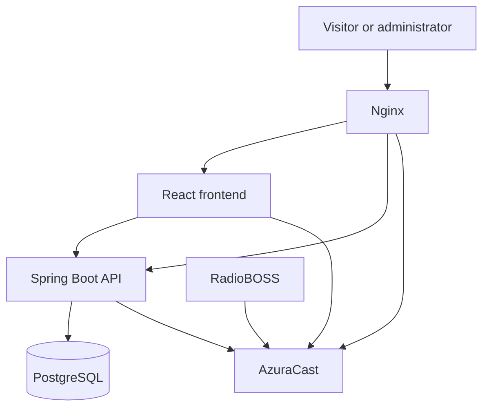

# System Architecture

## Overview

Online Radio Platform uses a reusable architecture that can be installed separately for each radio station. Each installation has its own website, backend, database, streaming service, and configuration.

## Components

### React frontend

- Displays the public radio website.
- Provides the audio player and weekly schedule.
- Displays current song or live program information.
- Provides the administration interface.
- Applies the station's branding settings.

### Spring Boot backend

- Exposes the REST API used by the frontend.
- Handles business rules and data validation.
- Manages programs, schedules, administrators, and branding.
- Communicates with PostgreSQL.
- Retrieves relevant streaming information from AzuraCast.

### PostgreSQL database

- Stores program information.
- Stores weekly schedules.
- Stores administrator accounts and roles.
- Stores station branding and configuration.

### AzuraCast

- Manages the station's music library.
- Provides continuous AutoDJ playback.
- Receives live broadcasts from RadioBOSS.
- Automatically switches between AutoDJ and live presenters.
- Provides streaming metadata and the public audio stream.

### RadioBOSS

- Produces live radio programs.
- Sends live audio to AzuraCast using the station's connection details.

### Nginx

- Receives public web traffic.
- Routes requests to the frontend, backend, and streaming service.
- Provides HTTPS access.

## Communication flow

1. A visitor opens the website through Nginx.
2. React requests programs, schedules, and branding from Spring Boot.
3. Spring Boot retrieves application data from PostgreSQL.
4. React retrieves the audio stream and current broadcast information.
5. AzuraCast plays AutoDJ music when no live presenter is connected.
6. RadioBOSS sends live audio to AzuraCast during live programs.
7. AzuraCast switches back to AutoDJ when the live connection ends.

## Architecture diagram

## Deployment model

Each customer receives a separate installation containing:

- Their own domain and branding.
- Their own Spring Boot backend.
- Their own PostgreSQL database.
- Their own AzuraCast station and music library.
- Their own administrator accounts.
- Their own private environment configuration.

The source code remains generic and reusable. Passwords, API keys, customer data, music files, and production configuration must never be committed to the public repository.